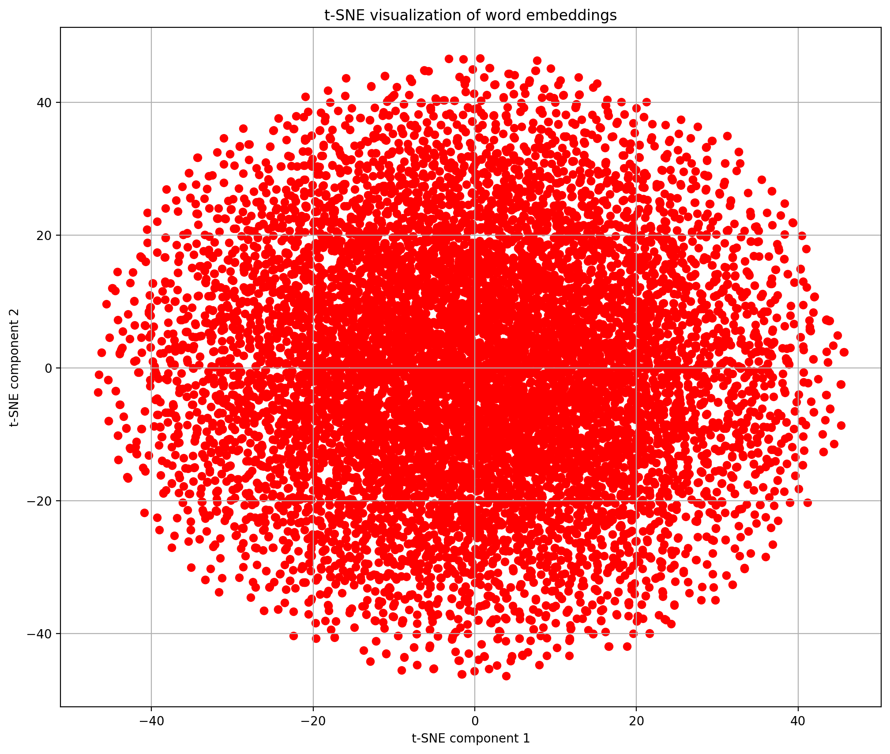
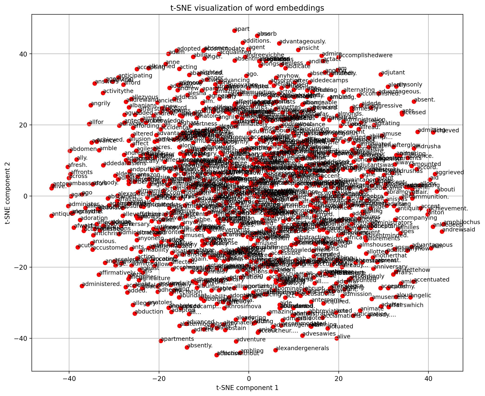
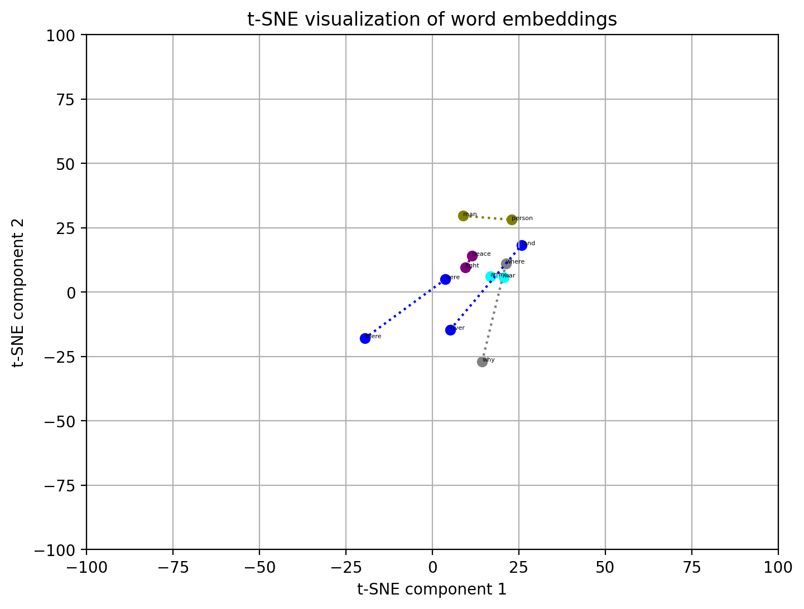

# Observations from t-SNE Plots

## Overview
t-SNE (t-distributed Stochastic Neighbor Embedding) plots are visualizations of high-dimensional data, like word embeddings, in a lower-dimensional space—typically 2D or 3D. The goal of t-SNE is to capture and reveal the structure and relationships in the data by positioning similar points (e.g., similar words) closer together, creating clusters.

---

## t-SNE Plot (2D Visualization)

*TSNE plot of 10000 words for clarity*

---

## Observations

One can see that words that have similar meaning are placed relatively closer in the embedding, and those with different meanings are further away. We have used a novel themed war and peace as the dataset, and thus may not be very accurate in context of most words, as it may treat every word in a different context than usual.